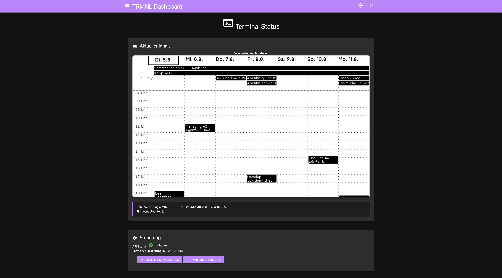

# TRMNL Dashboard

A sleek Flask web application for displaying and monitoring your TRMNL terminal content via the TRMNL Private API. Features a modern dark/light theme interface built with Materialize CSS.

   

## 📸 Screenshot



*The dashboard automatically loads your TRMNL display content and provides both compact and fullscreen viewing options.*

## ✨ Features

- 🎨 **Modern UI**: Clean, responsive interface with dark/light theme toggle
- 🔄 **Auto-Load**: Automatically loads TRMNL content on page load
- ⚡ **Real-time Updates**: Auto-refresh every 30 seconds
- 📱 **Mobile Friendly**: Responsive design for all screen sizes  
- 🖼️ **Fullscreen View**: Dedicated fullscreen mode with zoom and controls
- 🎮 **Interactive Controls**: Click to zoom, keyboard shortcuts, auto-hide UI
- 🛠️ **Developer Mode**: Auto-reload on code changes during development
- 🐳 **Docker Ready**: Containerized deployment support
- ⚡ **Fast Setup**: Quick installation with UV package manager

## 🚀 Quick Start

### Prerequisites

- Python 3.13+
- UV package manager ([installation guide](https://docs.astral.sh/uv/getting-started/installation/))
- TRMNL device with API access

### Installation

1. **Clone and setup**:
   ```bash
   git clone https://github.com/mmuyakwa/trmnl-dashboard.git
   cd trmnl-dashboard
   uv sync
   ```

2. **Configure your TRMNL device**:
   ```bash
   # Edit .env file
   nano .env
   ```
   
   Update the `TRMNL_DEVICE_ID` with your device's MAC address:
   ```env
   TRMNL_DEVICE_ID=A1:B2:C3:D4:E5:F6  # Replace with your device MAC
   ```

3. **Start the application**:
   ```bash
   uv run python app.py
   ```

4. **Open in browser**:
   ```
   http://localhost:5001
   ```

## 📋 Configuration

### Environment Variables

Edit the `.env` file to configure your setup:

```env
# TRMNL API Configuration
TRMNL_API_KEY=your-api-key-here
TRMNL_DEVICE_ID=XX:XX:XX:XX:XX:XX    # Your device MAC address
TRMNL_BASE_URL=https://trmnl.app/api

# Flask Configuration  
FLASK_ENV=development
FLASK_DEBUG=True      # Enables auto-reload on code changes
FLASK_PORT=5001       # Change if port 5001 is in use
```

### Finding Your Device ID

Your TRMNL Device ID is the MAC address of your device. You can find it:

1. **TRMNL Web Dashboard**: Device Settings section
2. **Device Label**: Physical sticker on the device
3. **TRMNL Mobile App**: Device information screen

Format: `XX:XX:XX:XX:XX:XX` (e.g., `A1:B2:C3:D4:E5:F6`)

## 🌐 API Endpoints

| Endpoint | Description | Response |
|----------|-------------|----------|
| `/` | Main dashboard interface | HTML page with auto-loaded content |
| `/api/status` | Current TRMNL status and content | JSON data |
| `/api/refresh` | Force refresh TRMNL content | JSON data |
| `/image` | Fullscreen image view with controls | Interactive HTML page |
| `/image/proxy` | Proxied image to avoid CORS issues | Image data |

### Example API Response

```json
{
  "success": true,
  "data": {
    "image_url": "https://trmnl.app/display/image.png",
    "filename": "dashboard.png",
    "update_firmware": false
  },
  "timestamp": "2025-08-05T19:20:00"
}
```

## 🎮 User Interface

### Dashboard Features

- **Auto-Loading**: Content loads automatically when you visit the page
- **Theme Toggle**: Switch between dark and light modes (saves preference)
- **Refresh Button**: Manually update TRMNL content
- **Fullscreen View**: Dedicated button for immersive viewing
- **Status Indicators**: Visual feedback for API connectivity

### Fullscreen Mode (`/image`)

- **Immersive Display**: Image fills the entire browser window
- **Interactive Controls**: 
  - Click image to zoom in/out
  - Mouse movement shows/hides header
  - Auto-refresh every 30 seconds
- **Keyboard Shortcuts**:
  - `R` - Refresh image
  - `F` - Toggle fullscreen
  - `Z` - Toggle zoom
  - `ESC` - Exit to dashboard
- **Mobile Optimized**: Touch-friendly controls

## 🐳 Docker Deployment

### Quick Docker Setup

1. **Build and run**:
   ```bash
   docker-compose up -d
   ```

2. **View logs**:
   ```bash
   docker-compose logs -f
   ```

3. **Stop container**:
   ```bash
   docker-compose down
   ```

### Manual Docker Build

```bash
# Build image
docker build -t trmnl-dashboard .

# Run container
docker run -d -p 5001:5000 --env-file .env trmnl-dashboard
```

## 🔧 Development

### Project Structure

```
trmnl-dashboard/
├── app/
│   ├── app.py              # Main Flask application
│   ├── templates/
│   │   ├── index.html      # Dashboard template
│   │   └── image.html      # Fullscreen view template
│   └── static/
│       └── style.css       # Custom CSS with themes
├── .env                    # Environment configuration
├── .env.example           # Configuration template
├── pyproject.toml         # Python dependencies
├── Dockerfile             # Container definition
├── docker-compose.yml     # Container orchestration
└── README.md              # This documentation
```

### Adding Features

1. **Enable debug mode** in `.env`:
   ```env
   FLASK_DEBUG=True
   ```

2. **Make changes** to the code
3. **Auto-reload** will restart the server automatically

### Running Tests

```bash
uv run pytest
```

### Code Formatting

```bash
uv run black app/
uv run flake8 app/
```

## 🚨 Troubleshooting

### Common Issues

| Problem | Solution |
|---------|----------|
| Connection refused | Check if another service uses port 5001, change `FLASK_PORT` |
| API Error 401 | Verify `TRMNL_API_KEY` and `TRMNL_DEVICE_ID` |
| Device not configured | Update `TRMNL_DEVICE_ID` with correct MAC address |
| Image not loading | Check TRMNL device connectivity and API response |
| Fullscreen issues | Try keyboard shortcuts or refresh the page |

### Debug Steps

1. **Check configuration**:
   ```bash
   cat .env
   ```

2. **Test API manually**:
   ```bash
   curl http://localhost:5001/api/status
   ```

3. **View application logs**:
   - Look for error messages in terminal output
   - Check browser console for JavaScript errors

4. **Verify TRMNL API**:
   - Ensure your device is online
   - Check TRMNL dashboard for device status

## 📝 Contributing

1. Fork the repository
2. Create a feature branch: `git checkout -b feature-name`
3. Make your changes
4. Test thoroughly
5. Submit a pull request

## 📄 License

MIT License - see LICENSE file for details.

## 🙋‍♂️ Support

For issues and questions:

1. Check the troubleshooting guide above
2. Review TRMNL API documentation
3. Create an issue in the repository
4. Contact TRMNL support for device-specific problems

---

**Note**: This application requires a TRMNL device with API access. Ensure you have proper permissions to use the TRMNL Private API.